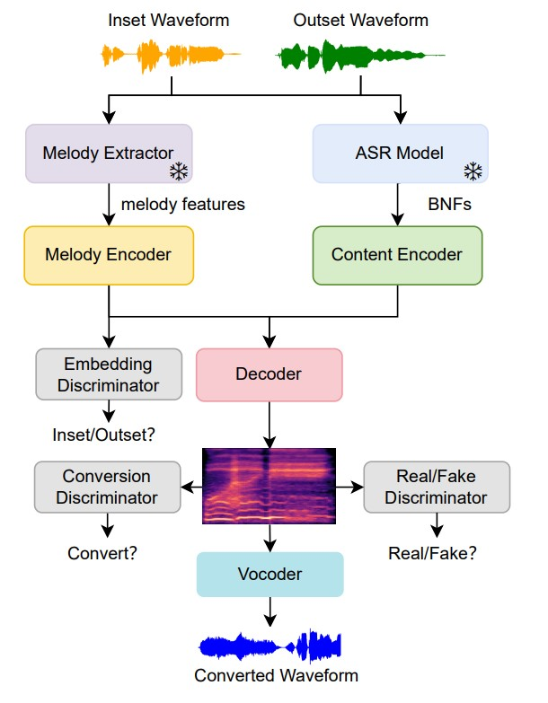
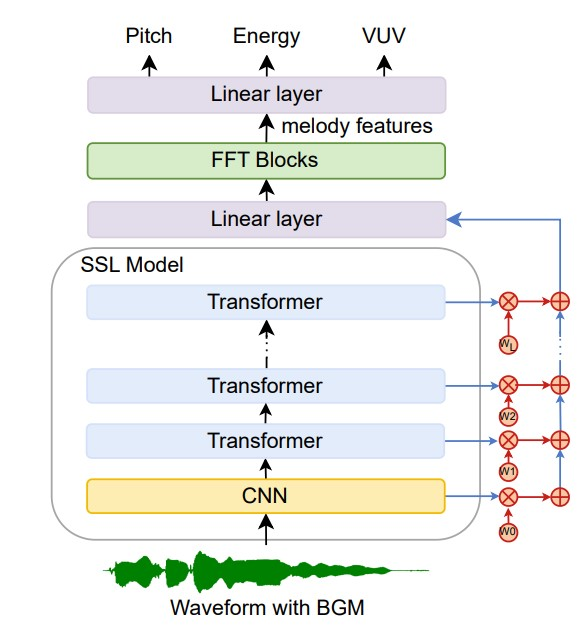

## Abstract

Melody preservation is crucial in singing voice conversion (SVC). However, in many scenarios, audio is often accompanied with background music (BGM), which can cause audio distortion and interfere with the extraction of melody and other key features, significantly degrading SVC performance.  Previous methods have attempted to address this by using more robust neural network-based melody extractors, but their performance drops sharply in the presence of complex accompaniment. Other approaches involve performing source separation before conversion, but this often introduces noticeable artifacts, leading to a significant drop in conversion quality and increasing the user’s operational costs. To address these issues, we introduce a novel SVC method that uses self-supervised representation-based melody features to improve melody modeling accuracy in the presence of BGM. In our experiments, we compare the effectiveness of different self-supervised learning (SSL) models for melody extraction and explore for the first time how SSL benefits the task of melody extraction. The experimental results demonstrate that our proposed SVC model significantly outperforms existing baseline methods in terms of melody accuracy and shows higher similarity and naturalness in both subjective and objective evaluations across noisy and clean audio environments.

 

<!-- <table style="border-collapse: collapse; width: 100%;">
<tr>
<td>

SVC framework.

</td>
<td>

Melody extractor.

</td>
</tr>
</table> -->

    <figure style="text-align: center;">
        
		<figcaption style="text-align: center;">
            <strong>SVC framework.</strong> 
            <small>Snowflake represents the parameter that remains unchanged when training the SVC framework.</small>
        </figcaption>
    </figure>
    <figure style="text-align: center;">
        
        <figcaption style="text-align: center;"><strong>Melody extractor.</strong></figcaption>
    </figure>

<!-- 

	
这是图片2的标题

这是图片2的标题

 -->

## Conversion Tasks

Our goal is to directly convert audio with complex background accompaniment into clean vocals performed by a target singer, while preserving the fine-grained melody information contained in the source waveform, leading to high naturalness.

We will generate waveforms with high timbre similarity, naturalness and
quality.

- **Proposed** - the proposed SVC method.
- **Original Pitch&Energy** - This method is the same as the proposed, except that it directly input pitch and energy into the melody encoder. The pitch is obtained from audio by taking the median of three methods: PYIN, REAPER, and Parselmouth.
- **Crepe** - This method is the same as "Original Pitch&Energy". The pitch is extracted from a noise-robust neural F0 extractor called Crepe.
- **Separated+Crepe** - This method utilizes the same model as proposed. We first separated songs into clean vocal tracks and BGMs using Demucs, and then extract pitch and energy from the clean vocal tracks using the Crepe model.
- **Separated** - This to show result from separated source songs into clean vocal tracks and BGMs using Demucs, even when the source audio is already clean.

  
Below are a few audios samples from the target speaker.

<audio controls>
				<source src="audios\target\2019000761.wav" type="audio/mpeg">
				Your browser does not support this audio format.
			</audio>
<audio controls>
				<source src="audios\target\2063002339.wav" type="audio/mpeg">
				Your browser does not support this audio format.
			</audio>
<audio controls>
				<source src="audios\target\2075002790.wav" type="audio/mpeg">
				Your browser does not support this audio format.
			</audio>
<audio controls>
				<source src="audios\target\2075002791.wav" type="audio/mpeg">
				Your browser does not support this audio format.
			</audio>

  

### Clean Vocal

<table>
<thead>
<tr class="header">
<th>NO</th>
<th>Original Pitch&Energy</th>
<th>Crepe</th>
<th>Separated</th>
<th>Separated+Crepe</th>
<th>Proposed</th>

</tr>
</thead>
<tbody>
<tr class="odd">
<td>1</td>
<td><audio controls>
				<source src="audios\clean\acous\0.wav" type="audio/mpeg">
				Your browser does not support this audio format.
			</audio></td>
<td><audio controls>
				<source src="audios\clean\crepe\0.wav" type="audio/mpeg">
				Your browser does not support this audio format.
			</audio></td>
<td><audio controls>
				<source src="audios\clean\separated\0.wav" type="audio/mpeg">
				Your browser does not support this audio format.
			</audio></td>
<td><audio controls>
				<source src="audios\clean\separated_crepe\0.wav" type="audio/mpeg">
				Your browser does not support this audio format.
			</audio></td>
<td><audio controls>
				<source src="audios\clean\proposed\0.wav" type="audio/mpeg">
				Your browser does not support this audio format.
			</audio></td>
</tr>
<tr class="even">
<td colspan="6">Source 1&emsp;transcript :
<em><strong>"这就是我心里的歌"</strong></em> &emsp;&emsp;&emsp;&emsp;
wav:&emsp;
<audio controls>
				<source src="audios\clean\source\0.wav" type="audio/mpeg">
				Your browser does not support this audio format.
			</audio>
</td>
</tr>

<tr class="odd">
<td>2</td>
<td><audio controls>
				<source src="audios\clean\acous\1.wav" type="audio/mpeg">
				Your browser does not support this audio format.
			</audio></td>
<td><audio controls>
				<source src="audios\clean\crepe\1.wav" type="audio/mpeg">
				Your browser does not support this audio format.
			</audio></td>
<td><audio controls>
				<source src="audios\clean\separated\1.wav" type="audio/mpeg">
				Your browser does not support this audio format.
			</audio></td>
<td><audio controls>
				<source src="audios\clean\separated_crepe\1.wav" type="audio/mpeg">
				Your browser does not support this audio format.
			</audio></td>
<td><audio controls>
				<source src="audios\clean\proposed\1.wav" type="audio/mpeg">
				Your browser does not support this audio format.
			</audio></td>
</tr>
<tr class="even">
<td colspan="6">Source 2&emsp;transcript :
<em><strong>"谢谢你做的一切 双手撑起我们的家"</strong></em> &emsp;&emsp;&emsp;&emsp;
wav:&emsp;
<audio controls>
				<source src="audios\clean\source\1.wav" type="audio/mpeg">
				Your browser does not support this audio format.
			</audio>
</td>
</tr>

<tr class="odd">
<td>3</td>
<td><audio controls>
				<source src="audios\clean\acous\2.wav" type="audio/mpeg">
				Your browser does not support this audio format.
			</audio></td>
<td><audio controls>
				<source src="audios\clean\crepe\2.wav" type="audio/mpeg">
				Your browser does not support this audio format.
			</audio></td>
<td><audio controls>
				<source src="audios\clean\separated\2.wav" type="audio/mpeg">
				Your browser does not support this audio format.
			</audio></td>
<td><audio controls>
				<source src="audios\clean\separated_crepe\2.wav" type="audio/mpeg">
				Your browser does not support this audio format.
			</audio></td>
<td><audio controls>
				<source src="audios\clean\proposed\2.wav" type="audio/mpeg">
				Your browser does not support this audio format.
			</audio></td>
</tr>
<tr class="even">
<td colspan="6">Source 3&emsp;transcript :
<em><strong>"Baby baby baby baby baby baby 是不是拥有以后"</strong></em> &emsp;&emsp;&emsp;&emsp;
wav:&emsp;
<audio controls>
				<source src="audios\clean\source\2.wav" type="audio/mpeg">
				Your browser does not support this audio format.
			</audio>
</td>
</tr>

<tr class="odd">
<td>4</td>
<td><audio controls>
				<source src="audios\clean\acous\3.wav" type="audio/mpeg">
				Your browser does not support this audio format.
			</audio></td>
<td><audio controls>
				<source src="audios\clean\crepe\3.wav" type="audio/mpeg">
				Your browser does not support this audio format.
			</audio></td>
<td><audio controls>
				<source src="audios\clean\separated\3.wav" type="audio/mpeg">
				Your browser does not support this audio format.
			</audio></td>
<td><audio controls>
				<source src="audios\clean\separated_crepe\3.wav" type="audio/mpeg">
				Your browser does not support this audio format.
			</audio></td>
<td><audio controls>
				<source src="audios\clean\proposed\3.wav" type="audio/mpeg">
				Your browser does not support this audio format.
			</audio></td>
</tr>
<tr class="even">
<td colspan="6">Source 4&emsp;transcript :
<em><strong>"没有原因的拘留"</strong></em> &emsp;&emsp;&emsp;&emsp;
wav:&emsp;
<audio controls>
				<source src="audios\clean\source\3.wav" type="audio/mpeg">
				Your browser does not support this audio format.
			</audio>
</td>
</tr>

</tbody>
</table>

  

  
   
   

### Vocal with BGM

<table>
<thead>
<tr class="header">
<th>NO</th>
<th>Original Pitch&Energy</th>
<th>Crepe</th>
<th>Separated</th>
<th>Separated+Crepe</th>
<th>Proposed</th>

</tr>
</thead>
<tbody>

<tr class="odd">
<td>1</td>
<td><audio controls>
				<source src="audios\noisy\acous\2.wav" type="audio/mpeg">
				Your browser does not support this audio format.
			</audio></td>
<td><audio controls>
				<source src="audios\noisy\crepe\2.wav" type="audio/mpeg">
				Your browser does not support this audio format.
			</audio></td>
<td><audio controls>
				<source src="audios\noisy\separated\2.wav" type="audio/mpeg">
				Your browser does not support this audio format.
			</audio></td>
<td><audio controls>
				<source src="audios\noisy\separated_crepe\2.wav" type="audio/mpeg">
				Your browser does not support this audio format.
			</audio></td>
<td><audio controls>
				<source src="audios\noisy\proposed\2.wav" type="audio/mpeg">
				Your browser does not support this audio format.
			</audio></td>
</tr>
<tr class="even">
<td colspan="6">Source 1&emsp;transcript :
<em><strong>"任性的随意的 放肆的轻易的"</strong></em> &emsp;&emsp;&emsp;&emsp;
wav:&emsp;
<audio controls>
				<source src="audios\noisy\source\2.wav" type="audio/mpeg">
				Your browser does not support this audio format.
			</audio>
</td>
</tr>

<tr class="odd">
<td>2</td>
<td><audio controls>
				<source src="audios\noisy\acous\1.wav" type="audio/mpeg">
				Your browser does not support this audio format.
			</audio></td>
<td><audio controls>
				<source src="audios\noisy\crepe\1.wav" type="audio/mpeg">
				Your browser does not support this audio format.
			</audio></td>
<td><audio controls>
				<source src="audios\noisy\separated\1.wav" type="audio/mpeg">
				Your browser does not support this audio format.
			</audio></td>
<td><audio controls>
				<source src="audios\noisy\separated_crepe\1.wav" type="audio/mpeg">
				Your browser does not support this audio format.
			</audio></td>
<td><audio controls>
				<source src="audios\noisy\proposed\1.wav" type="audio/mpeg">
				Your browser does not support this audio format.
			</audio></td>
</tr>
<tr class="even">
<td colspan="6">Source 2&emsp;transcript :
<em><strong>"Take a sad song and make it better"</strong></em> &emsp;&emsp;&emsp;&emsp;
wav:&emsp;
<audio controls>
				<source src="audios\noisy\source\1.wav" type="audio/mpeg">
				Your browser does not support this audio format.
			</audio>
</td>
</tr>

</tbody>
</table>

